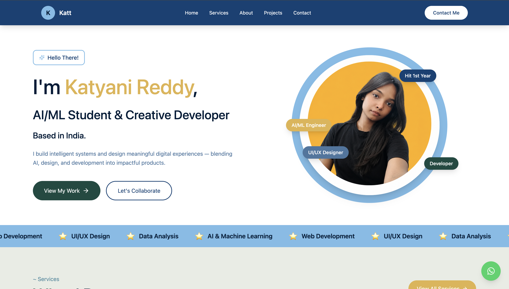

 # 🌐 Katyani Reddy — Portfolio Website

A modern, responsive portfolio website showcasing my work in AI/ML, Web Development, and UI/UX Design.

🔗 Live Website: https://your-portfolio.vercel.app  
📂 GitHub Repo: https://github.com/katyanireddy/portfolio-website.git
---

## 🚀 About Me

Hi, I'm **Katyani Reddy** 👋  
An AI/ML student and creative developer passionate about building intelligent systems and meaningful digital experiences.

I blend:
- 🤖 Artificial Intelligence  
- 💻 Web Development  
- 🎨 UI/UX Design  

to create impactful products.

---

## 🧠 Projects

### 🔹 SignBridge  
AI-powered system that translates sign language into real-time text using computer vision.

### 🔹 QuantumXDelta  
A smart school & coaching platform with admin dashboard and AI chatbot.

### 🔹 GrayCollar  
Platform connecting retired professionals with flexible job opportunities.

### 🔹 HeartLift  
AI-powered breakup recovery app with emotional support and guided healing.

---

## 🛠 Tech Stack

- **Frontend:** React, Tailwind CSS  
- **Languages:** JavaScript, Python  
- **Tools:** Git, GitHub, Figma  
- **AI/ML:** Machine Learning, Data Analysis  

---

## ✨ Features

- Fully responsive design  
- Smooth UI/UX  
- Interactive project showcase  
- Contact form integration  
- WhatsApp quick contact  
- Modern animations  

---

## 📸 Preview



(./public/preview2.png)
(./public/preview3.png)

(./public/preview4.png)


---

## 📬 Contact Me

- 📧 Email: katyanireddy17@gmail.com  
- 📱 Phone: +91 7691833047  
- 💼 LinkedIn: https://linkedin.com/in/katyanireddy  
- 💻 GitHub: https://github.com/katyanireddy  

---

## 🧾 Resume

👉 [View Resume](https://canva.link/ngigko6glpsnbm0)

---

## ⚡ Installation (for developers)

```bash
git clone https://github.com/katyanireddy/portfolio-website.git
cd portfolio
npm install
npm run dev
  ## Running the code

  Run `npm i` to install the dependencies.

  Run `npm run dev` to start the development server.
  
